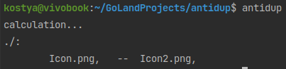

deprecated. see https://github.com/Stasenko-Konstantin/antidup-rs

# antidup
to find duplicates of photos (.png, .jpg and .jpeg)

# TODO
- [ ] Loading ~~animation~~ message
- [x] Display of image size in mb/kb/etc
- [ ] Recursive analysis of subdirectories
- [ ] Analysis of the selected directory
- [ ] Cache
