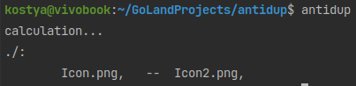

# antidup-rs (blazingly fast 🚀)
to find duplicates of photos (.png, .jpg and .jpeg)                                
based on [phash algorithm](https://www.phash.org/docs/pubs/thesis_zauner.pdf)



processes 2.5k images for 1.5m 

### todo
- [x] loading ~~animation~~ message
- [x] display of image size in mb/KB/etc
- [x] analysis of the selected directory
- [x] delete duplicates
- [x] fix image reading
- [x] fix help message (antidup-rs -> antidup)
- [ ] strictness

### get

requires nightly [cargo](https://www.rust-lang.org/tools/install) for building executable file

```bash
git clone git@github.com:Stasenko-Konstantin/antidup-rs.git 
cd antidup-rs
./build.sh     # requires sudo for cp executable file to /bin
               # reopen terminal
antidup -h                  
```

### usage

```bash
Usage: antidup [OPTIONS]

Options:
  -q, --quiet                  
      --rm                     
  -r, --recursive <RECURSIVE>  [default: non] [possible values: non, segmented, flat]
  -d, --deep <DEEP>            [default: 0]
  -p, --path <PATH>            
  -h, --help                   Print help
  -V, --version                Print version
```
